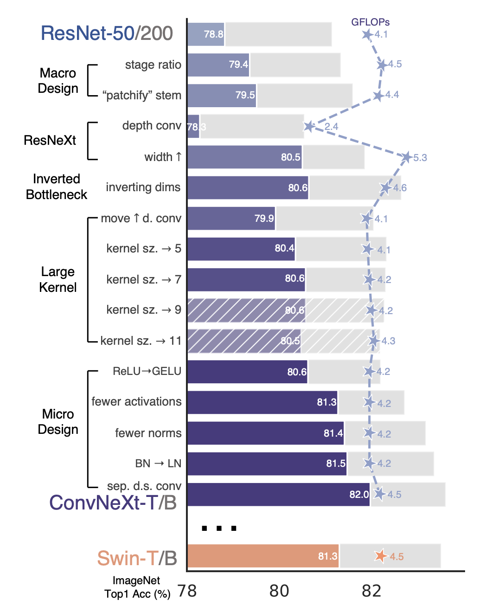
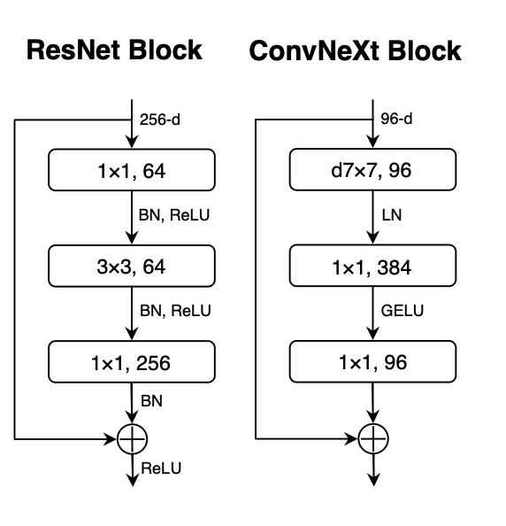
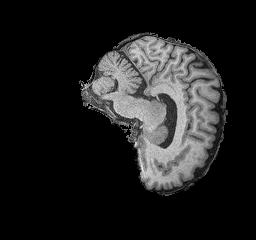
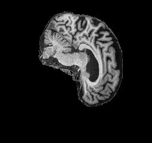
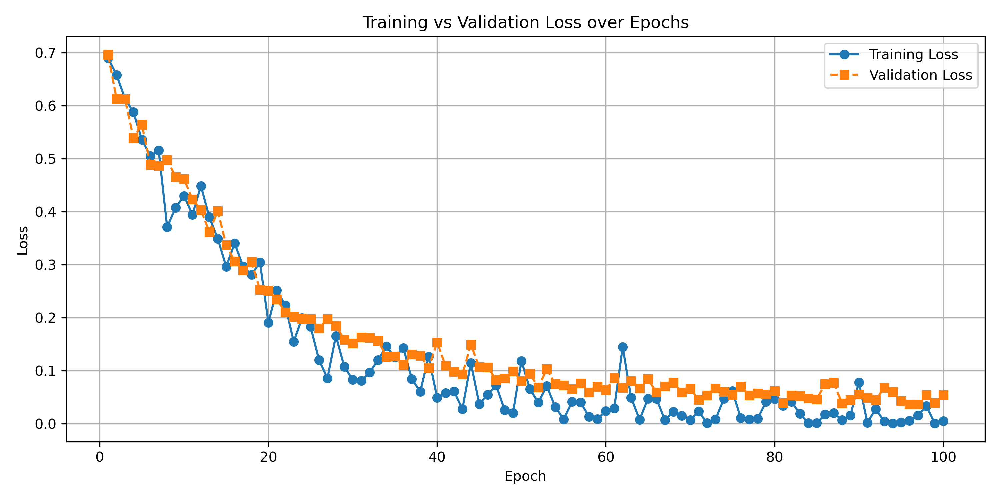
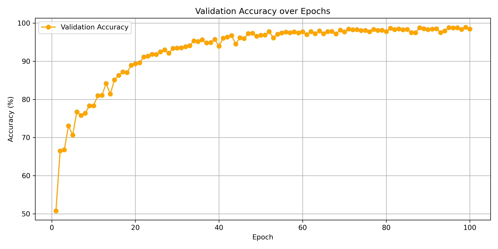
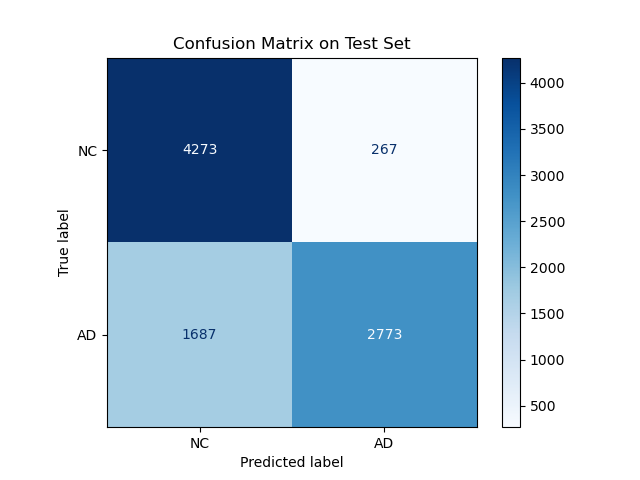

# Classification of Alzheimer's Disease using ConvNeXt

**Author**: Cyrus Forudi (48043018)

---

## Project Overview

The aim of this project is to build a classifier for Alzheimer's Disease using the MRI brain scans in the ADNI dataset. By using the latest vision models, namely ConvNeXt, we aim to classify between between two classes:

- Normal Control (NC); and
- Alzheimer's Disease (AD).

with a goal of at least 80% accuracy on the test data.

The selected model is ConvNeXt-T (Tiny), a small sized model appropriate for the amount of images in the ADNI dataset. It is **not** pre-trained on the ImageNet as in the paper, but trained from scratch on the ADNI data.

The model was trained on a Google Colab A100 GPU and reached 78.29% accuracy.

---

## Table of Contents

- [Project Overview](#project-overview)
- [Reproducibility and Dependencies](#reproducibility-and-dependencies)
- [Running the Project](#running-the-project)
- [Model Architecture](#model-architecture)
- [Data](#data)
- [Training](#training)
- [Results Analysis](#results-analysis)
- [Evaluation](#evaluation)
- [Improvements and Extensions](#improvements-and-extensions)
- [Conclusion](#conclusion)
- [Appendix](#appendix)
- [References](#references)

---

## Reproducibility and Dependencies

All dependencies are found in `environment.yml` file. Some key dependencies are:

- torch==2.8.0
- torchvision==0.23.0
- numpy=2.3.1
- matplotlib=3.10.5
- scikit-learn=1.7.1

To create the environment run:

```bash
    conda env create -f environment.yml
    conda activate torch
```

## Running the Project

Assuming you have the ADNI dataset.

1. Modify the `MACHINE` variable in `train.py` and `predict.py` to reflect whether you are running on your local machine, Google Colab, or Rangpur. This is to adjust the file paths and the number of allowed worker threads depending on the platform. (Reported training was conducted on Google Colab)

2. Execute the following commands:

    ```bash
    python3 train.py
    python3 predict.py
    ```

When `train.py` is run, it will output a file called `model.pth` which contains the trained model weights. This will then be used by `predict.py` to run inference on the testing data.

## Model Architecture

### ConvNeXt Design

The ConvNeXt model emerged recently to combat the idea that "Transformers are better at Computer Vision than Convolutional Neural Networks". Liu et al [[1](#references)] wanted to build a pure convolutional network that could perform at the same standard as a transformer model.

This was achieved by mimicking the concept of self-attention but using only convolution. The ConvNeXt architecture began with a ResNet-50 model and modernised this through 5 design decisions as seen below:

1. macro design
2. ResNeXt
3. inverted bottleneck
4. large kernel size
5. various layer-wise micro designs


> *Figure 1: design decisions of ConvNeXt from ResNet*

### Why ConvNeXt?

Here are some reasons why ConvNeXt is a suitable model for classifying brain MRI scans for Alzheimer's:

1. **Increased Kernel Size:** ConvNeXt has a 7x7 kernel, much larger than the standard 3x3 used in ResNet. This allows for capturing global structural features of the brain.
2. **Inverted Bottleneck:** instead of compressing like the ResNet, the number of channels is first expanded (namely multiplied by 4), depthwise convolutions occur, and they are projected back down. This allows high dimensional feature extraction and identifying fine-grained variations in brain textures that are critical for distinguishing AD and NC brains.
3. **Depthwise Convolutions:** this means that one filter is used per input channel. Then pointwise 1x1 convolutions happen. This reduces parameter count and the risk of overfitting, important given the small dataset size.
4. **Efficiency Advantage:** ConvNeXt has comparable or better performance than Vision Transformers while having lower data and computation requirements.


> *Figure 2: ConvNeXt block architecture vs ResNet archicecture*


### Model Selection

When comparing the different sizes in the ConvNeXt model family,
5 different variants of the ConvNeXt model were considered:

- ConvNeXt-T: C = (96, 192, 384, 768), B = (3, 3, 9, 3)
- ConvNeXt-S: C = (96, 192, 384, 768), B = (3, 3, 27, 3)
- ConvNeXt-B: C = (128, 256, 512, 1024), B = (3, 3, 27, 3)
- ConvNeXt-L: C = (192, 384, 768, 1536), B = (3, 3, 27, 3)
- ConvNeXt-XL: C = (256, 512, 1024, 2048), B = (3, 3, 27, 3)

The ConvNeXt-T (tiny) architecture was chosen as it is most suitable for the size of the limited dataset. Smaller datasets are common in medical imaging due to limitations such as cost and privacy.


## Data

There are 2 classes in the provided ADNI dataset:

- Normal Control (NC); and
- Alzheimer's Disease (AD).


>*Figure 3: NC brain example*


>*Figure 4: AD brain example*

The original data provided was only split into 2 sets, training and testing. However, in machine learning it is beneficial to also have a validation set for tuning hyperparameters. To solve this, the full training set was separated with an 80/20 split into training and validation images respectively. The training data was split rather than the testing data in order to keep the test set completely isolated and avoid the risk of data leakage and overfitting. As seen below a seed is used so that the split is always the same and remains reproducible.

```python
generator = torch.Generator().manual_seed(42) 
train_dataset, val_dataset 
  = torch.utils.data.random_split(train_dataset, [0.8, 0.2], generator=generator)
```

This resulted in the following dataset sizes:

*30,590* total images

- Training Set: (total images 17,262)
  - NC : 8958 images
  - AD : 8304 images

- Validation Set: (total images 4,315)
  - NC : 2191 images
  - AD : 2124 images

- Testing Set: (total images 9,013)
  - NC : 4540 images
  - AD : 4473 images

The resulting split is therefore approximately 57% training, 14% validation, and 29% testing.
This ensures that the majority of the data is dedicated to the training of the model, while there is some used for training hyperparameters, and a reasonable amount left at the end for unbiased testing of the performance of the model.

## Training

### Training Data Preprocessing

The following transformations were applied to all images in the training dataset:

- **Resize:** the images were all resized to 224x224 pixels to ensure compatibility with the model
- **Random Rotation:** images have a chance of being rotated up to 10 degrees in either direction, allowing the learning of features at different orientations and not introducing too large of a change to the image
- **Random Affine Transform:** a small translation of up to 5% which shifts the position of the image to remove bias of the brain having to be in a particular place in the image
- **Random Resized Crop:** a random crop of 224x224 pixels is applied
- **Colour Jitter:** randomly vary the brightness and contrast in images so that the model learns to work in different lighting conditions
- **Normalise** since image is black and white, we normalise with a mean and standard deviation of 0.5 on all three channels so the model treats inputs consistently

These transformations all remove bias in the model and help it to learn the true features of the brain across different light and orientation conditions, not overfitting to any particular imaging angles or lighting that is present in the training data but learning the general features.
The same was applied to the validation set.

``` python
train_transform = transforms.Compose([
    transforms.Resize((224, 224)),
    transforms.RandomRotation(degrees=10),       
    transforms.RandomAffine(degrees=0, translate=(0.05,0.05), scale=(0.95,1.05)),
    transforms.RandomResizedCrop(224, scale=(0.9,1.0)),
    transforms.ColorJitter(brightness=0.1, contrast=0.1),  
    transforms.ToTensor(),
    transforms.Normalize(mean=[0.5, 0.5, 0.5], std=[0.5, 0.5, 0.5])
])
```

### Testing Data Preprocessing

Only very simple transforms were applied to the testing data. It is important not to augment the testing data so we see the accuracy against real world images and use cases of the model. Transformations were:

- **Resize:** the images were all resized to 224x224 pixels to ensure compatibility with the model
- **Normalise** again the images were normalised with 0.5 mean and standard deviation across the three channels for consistency.

``` python
test_transform = transforms.Compose([
    transforms.Resize((224, 224)),
    transforms.ToTensor(),
    transforms.Normalize(mean=[0.5, 0.5, 0.5], std=[0.5, 0.5, 0.5])
])
```

### Training Configuration

- Optimiser: AdamW chosen as mentioned in the ConvNeXt paper
- Learning Rate: 0.0001
- Loss Function: Cross Entropy Loss

```python
criterion = nn.CrossEntropyLoss()
optimizer = optim.AdamW(model.parameters(), lr=learning_rate)
```

### Training Loop

Hyperparameters

```python
num_epochs = 100
learning_rate = 1e-4
batch_size = 128
```

The steps in the training loop are:

1. Forward Pass: each batch of images is passed through the ConvNeXt model

2. Loss is calculated with cross entropy

3. Backpropagation and Optimisation

Sample of the training loop:

```python
train_losses = []
for epoch in range(num_epochs):
    model.train()
    running_loss = 0.0
    for batch , content in enumerate(train_loader):
        images, labels = content[0].to(device), content[1].to(device)
        optimizer.zero_grad()
        outputs = model(images)
        loss = criterion(outputs, labels)
        # backpropagation
        loss.backward()
        optimizer.step()
        optimizer.zero_grad()

        if batch % 10 == 0:
            loss, current = loss.item(), batch * batch_size + len(images)
            print(f"Epoch [{epoch+1}/{num_epochs}], \
               Step [{current}/{len(train_loader.dataset)}], Loss: {loss:.4f}")

```


> *Figure 6: graph of training loss and validation loss per epoch*

It is seen in figure 6 that the training loss strongly decreases as the epochs pass, gradually levelling out. It is observed that the validation loss follows closely this pattern with the training loss, albeit a little higher. Clearly, this is expected as the model is being trained on the training data. The close following of the validation loss implies that the training was successful and that the model did not overfit on the training set, maintaining good generalisablility and usefulness for other images not directly trained upon.


> *Figure 7: graph of validation accuracy vs epochs*

It is seen in figure 7 that the validation accuracy strongly increases as the epochs pass, gradually levelling out. This means that the training is successful and it has extracted features of the brain that are useful in classifying images not directly in the training set.

## Results Analysis


> *Figure 8: Confusion Matrix*

It is seen in figure 8 that the majority of predictions were true positives and true negatives. Specifically:

- Normal Control (NC)
  - Correct Predictions (True Negatives): 4273
  - Misclassified as AD (False Positives): 267
- Alzheimer's Disease (AD)
  - Correct Predictions (True Positives): 2773
  - Misclassified as NC (False Negatives): 1687

This goes along with the 78.29% accuracy that was achieved, to show that the model has been effective in learning to classify Alzheimer's.

## Evaluation

Although a high level of accuracy was achieved in the model, it can be seen in the Confusion Matrix that false negatives (i.e. predicting NC but truth being AD) are much more common than false positives. This means the model will underdiagnose rather than overdiagnose alzheimers. In a medical setting this would not be prefered. It would be better to have an oversensitive model that is more likely to classify people as having Alzheimer's so that they get examined and a professional opinion, even if they end up being healthy. This would be more beneficial than their illnes "flying under the radar" and being left untreated.

The results are reproducible and obtained through valid Machine Learning methods and thus are concluded to be reliable. Although the data set was quite limited, limiting the effectiveness of the model.

## Improvements and Extensions

- Instead of a binary classification of NC or AD, incorporate more data of various stages of the brain disease so that more nuance and features can be learned by the model.
- Obtain a larger dataset to make the model more accurate as it has more images to extract features and learn from. Then potentially could use one of the larger variants of ConvNeXt such as Small, Big, or Large.
- Incorporate additional data augmentations to simulate more real world environments, further changes in orientation, lighting, angles, etc to extend the generalisability of the model
- Hyperparameters could be further fine tuned to improve accuracy.

## Conclusion

The model achieved 78.29% accuracy against the test set, very close to the goal of 80%. The large kernel and inverted bottleneck architecture enabled the extraction of global features in a similar way to the attention mechanism of transformers.

There is some room for improvements such as a larger dataset, experimenting with the larger archictectures and incorporating more data augmentations.

## Appendix

Additional helper scripts and output data can be found in the [./images](./images) subdirectory. Namely:

- `parser.py`: a helper script to parse the printed outputs from model training into a csv file if training is already complete and the values are no longer loaded in memory. Outputs to the file `validation_data.csv` for analysis and graph generating
- `graphing.py`: given a csv file with info about the training loss, validation loss, and validation accuracy at each epoch, generates the relevant graphs

## References

1. Liu, Z., Mao, H., Wu, C.-Y., Feichtenhofer, C., Darrell, T., & Xie, S. (2022). A ConvNet for the 2020s. ArXiv:2201.03545 [Cs]. [https://arxiv.org/abs/2201.03545](https://arxiv.org/abs/2201.03545)

2. facebookresearch. (2025). ConvNeXt/models/convnext.py at main · facebookresearch/ConvNeXt. GitHub. [https://github.com/facebookresearch/ConvNeXt/blob/main/models/convnext.py](https://github.com/facebookresearch/ConvNeXt/blob/main/models/convnext.py)

3. Muhammad Ardi. (2025, May 6). ConvNeXt Paper Walkthrough: The CNN That Challenges ViT | Towards Data Science. Towards Data Science. [https://towardsdatascience.com/the-cnn-that-challenges-vit/](https://towardsdatascience.com/the-cnn-that-challenges-vit/https://towardsdatascience.com/the-cnn-that-challenges-vit/)

Github Copilot and GPT-5 were used to speed up the development of this project.
