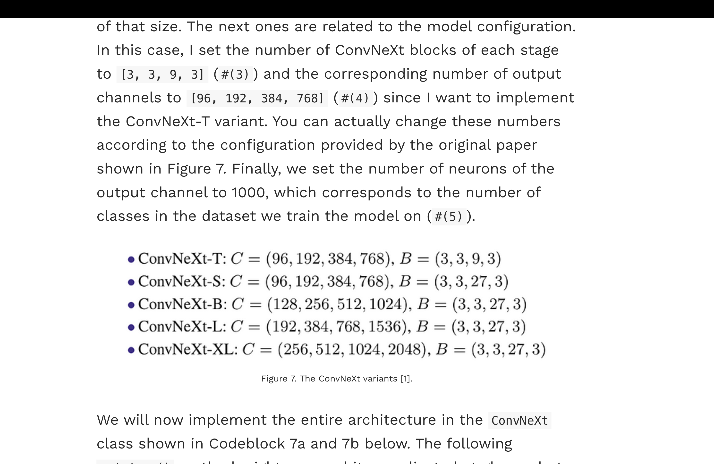

# Classification of Alzheimer's Disease using ConvNeXt

**Author**: Cyrus Forudi (48043018)

---

## Project Overview

The aim of this project is to build a classifier for Alzheimer's Disease using the MRI brain scans in the ADNI dataset. By using the latest vision models, namely ConvNeXt, we aim to classify between between two classes:

- Normal Control (NC); and
- Alzheimer's Disease (AD).

with a goal of at least 80% accuracy on the test data.

The selected model is ConvNeXt-T (Tiny), a small sized model appropriate for the amount of images in the ADNI dataset. It is **not** pre-trained on the ImageNet as in the paper, but trained from scratch on the ADNI data.


---

## Table of Contents

- [Project Overview](#project-overview)
- [References](#references)

---

## Reproducibility and Dependencies

The dependencies are:

- torch==2.8.0
- torchaudio==2.8.0
- torchvision==0.23.0

To create the environment run:

```bash
    conda env create -f environment.yml
    conda activate torch
```

## Model Architecture

### Model Selection

compare the different sizes of the ConvNeXt model:
5 different variants of the ConvNeXt model were considered:


The ConvNeXt-T (tiny) architecture was chosen as it is most suitable for the size of the limited dataset. Smaller datasets are common in medical imaging due to limitations such as cost and privacy.


## Data

There are 2 classes in the provided ADNI dataset:

*30,590* total images

- Normal Control (NC); and
- Alzheimer's Disease (AD).

The original data provided was only split into 2 sets, training and testing. However, in machine learning it is beneficial to also have a validation set for tuning hyperparameters. To solve this, the full training set was separated with an 80/20 split into training and validation images respectively. The training data was split rather than the testing data in order to keep the test set completely isolated and avoid the risk of data leakage and overfitting.

This resulted in the following dataset sizes:

- Training Set: (total images 17,262)
  - NC : 8958 images
  - AD : 8304 images

- Validation Set: (total images 4,315)
  - NC : 2191 images
  - AD : 2124 images

- Testing Set: (total images 9,013)
  - NC : 4540 images
  - AD : 4473 images

The resulting split is therefore approximately 57% training, 14% validation, and 29% testing.
This ensures that the majority of the data is dedicated to the training of the model, while there is some used for training hyperparameters, and a reasonable amount left at the end for unbiased testing of the performance of the model.

## Training

### Training Data Preprocessing

explain this

``` python
train_transform = transforms.Compose([
    transforms.Resize((224, 224)),
    transforms.RandomRotation(degrees=10),       # small rotations
    transforms.RandomAffine(degrees=0, translate=(0.05,0.05), scale=(0.95,1.05)),
    transforms.RandomResizedCrop(224, scale=(0.9,1.0)),
    transforms.ColorJitter(brightness=0.1, contrast=0.1),  # mild intensity jitter
    transforms.ToTensor(),
    transforms.Normalize(mean=[0.5, 0.5, 0.5], std=[0.5, 0.5, 0.5]) # Normalise the image
])
```

### Testing Data Preprocessing

explain this

``` python
test_transform = transforms.Compose([
    transforms.Resize((224, 224)),
    transforms.ToTensor(),
    transforms.Normalize(mean=[0.5, 0.5, 0.5], std=[0.5, 0.5, 0.5]) # Normalise the image
])
```

## Results

## Evaluation

## Improvements and Extensions

## Conclusion

## References

1. Liu, Z., Mao, H., Wu, C.-Y., Feichtenhofer, C., Darrell, T., & Xie, S. (2022). A ConvNet for the 2020s. ArXiv:2201.03545 [Cs]. [https://arxiv.org/abs/2201.03545](https://arxiv.org/abs/2201.03545)

2. facebookresearch. (2025). ConvNeXt/models/convnext.py at main · facebookresearch/ConvNeXt. GitHub. [https://github.com/facebookresearch/ConvNeXt/blob/main/models/convnext.py](https://github.com/facebookresearch/ConvNeXt/blob/main/models/convnext.py)

3. Muhammad Ardi. (2025, May 6). ConvNeXt Paper Walkthrough: The CNN That Challenges ViT | Towards Data Science. Towards Data Science. [https://towardsdatascience.com/the-cnn-that-challenges-vit/](https://towardsdatascience.com/the-cnn-that-challenges-vit/https://towardsdatascience.com/the-cnn-that-challenges-vit/)

Github Copilot and GPT-5 were used to speed up the development of this project.
